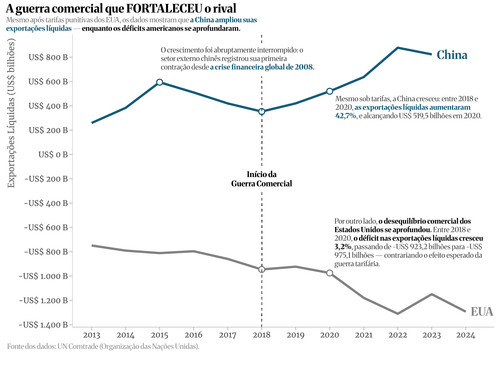

## Introdução

Ao longo da história econômica, disputas comerciais têm sido muito mais do que meras discordâncias sobre tarifas ou questões de saldo comercial. Em um mundo cada vez mais interdependente, decisões tomadas pelas grandes potências repercutem globalmente, alterando caminhos, influenciando estratégias e mudando as dinâmicas entre nações. 

A guerra comercial entre Estados Unidos e China, iniciada em 2018, é um exemplo emblemático dessa complexidade. Muito além de sanções pontuais, a disputa evidenciou profundas tensões entre diferentes modelos econômicos, interesses geopolíticos, de tal modo influenciado por visões conflitantes sobre o papel do comércio internacional.

Para compreender as consequências dessa rivalidade, é útil recorrer a duas teorias fundamentais da economia. A primeira, o Modelo Mundell-Fleming, explica que em economias abertas com câmbio flutuante e livre circulação de capital, políticas comerciais protecionistas têm poucos efeitos, podendo até enfraquecer economicamente o país que as adota, ou seja, haverá perda de eficiência. 

Já a clássica teoria das Vantagens Comparativas, proposta por David Ricardo, sugere que cada nação deveria se especializar em produzir aquilo em que é relativamente mais eficiente, resultando em benefícios mútuos para todos os envolvidos — desde que não haja barreiras comerciais impedindo esse comércio.

Este estudo explora a guerra comercial através dessas perspectivas. Avalia as consequências dessa disputa sobre setores econômicos estratégicos, seu impacto nas balanças comerciais e as mudanças geopolíticas impulsionadas por decisões políticas aparentemente simples, mas de profunda repercussão. O que emerge dessa análise é um cenário em constante transformação, onde cada movimento altera sutilmente o panorama global das relações econômicas.

Sem oferecer conclusões definitivas, este artigo convida o leitor a refletir sobre algumas questões importantes:

> ***O que revelam sobre a racionalidade — ou a ausência dela — as decisões políticas movidas por ideologias que desafiam teorias econômicas consagradas, em disputas internacionais por mercados e influência?***

Para responder a essas perguntas, recorremos a evidências empíricas extraídas da base de dados da Organização das Nações Unidas, a partir da qual foram organizados os fluxos de importação e exportação dos países envolvidos. Com base nesses dados, foi possível calcular as exportações líquidas e observar, de forma mais elucidativa, como os efeitos dessa disputa se materializaram ao longo do tempo tanto para os protagonistas quanto para aqueles que, estrategicamente, souberam ocupar os espaços deixados pelas tensões comerciais.

## A Lógica do Jogo: quem ganhou com as tarifas?

Entre 2018 e 2020, apesar das tarifas impostas pelos Estados Unidos, as exportações da China aumentaram para 42,7%, com um superávit nas exportações líquidas de 519,5 bilhões em 2020. O país manteve forte presença no mercado internacional durante a pandemia, pois atingiu um superávit comercial recorde de 877,6 bilhões de dólares em 2022. A Figura 1 ilustra essa trajetória ascendente da China em contraposição com o agravamento do déficit americano ao longo do mesmo período.

Nos Estados Unidos, o déficit comercial, já expressivo antes das medidas protecionistas, se agravou ainda mais após as novas tarifas. De 2018 a 2020, o saldo negativo cresceu 3,2%, com um déficit nas exportações líquidas de 975,1 bilhões de dólares durante 2020, e seguiu crescendo até alcançar a marca histórica de 1,31 trilhão de dólares negativos em 2022.

<figure style="text-align: center;">
  
  <figcaption style="margin-top: -1em; font-size: 0.95em;">
    <strong>Figura 1:</strong> Exportações líquidas na guerra comercial entre Estados Unidos e China
  </figcaption>
</figure>

Já o Brasil, ainda que não estivesse diretamente envolvido na disputa, identificou oportunidades para expandir sua posição comercial. Após uma queda nas exportações em 2019, o país viu seu saldo comercial aumentar em 53,2% em 2020, chegando a mais que duplicar em 2023. 

Essas mudanças nas rotas comerciais globais permitiram que o Brasil se destacasse como um parceiro alternativo em um cenário marcado pela tensão entre as duas maiores economias.

### Onde a teoria falha ou o mundo muda

#### O paradoxo de proteger e perder

Um exemplo prático da Teoria das Vantagens Comparativas ocorreu após as tarifas americanas sobre produtos chineses em 2018, quando o Brasil substituiu os Estados Unidos como principal fornecedor de soja para a China. Com o aumento nos preços devido às tarifas, os produtores americanos perderam competitividade num setor onde antes dominavam. 

Por outro lado, o Brasil, que mantinha custos mais baixos e uma produção eficiente, aproveitou essa abertura para ocupar quase toda a participação anteriormente pertencente aos Estados Unidos, conforme relatado pelo Departamento de Agricultura dos Estados Unidos em seu relatório *Brazil Soybeans 2020/21: Another Season with a Record Harvest*, ano em que o país colheu 137 milhões de toneladas em uma safra histórica, um desempenho que colocou o Brasil no centro do fornecimento global de soja. Esse caso demonstra como políticas comerciais restritivas podem distorcer custos relativos e beneficiar economias com menores barreiras comerciais e maior eficiência produtiva.

Na indústria automobilística, setor tradicionalmente forte nos Estados Unidos, as tarifas impostas a partir de 2025 sobre importações do Canadá, México e China trouxeram sérias consequências. As cadeias produtivas integradas desses países sofreram um aumento expressivo nos custos, chegando até 10 mil dólares adicionais por veículo. As indústrias canadense e mexicana, diretamente ameaçadas, podem ser obrigadas a fechar suas fábricas, o que leva a uma perda considerável de empregos, de acordo com a análise de Partsinevelos (2025).

#### Mundell-Fleming em tempos de guerra comercial

Do ponto de vista macroeconômico, as consequências recentes dessa disputa comercial ilustram claramente o Modelo Mundell-Fleming. Após as novas tarifas americanas, moedas como euro, iene e libra tiveram valorização, enquanto o yuan foi intencionalmente desvalorizado pelo governo chinês para atenuar o impacto tarifário ao tornar seus produtos mais acessíveis nos Estados Unidos. 

De igual modo, cresce a especulação de que a China possa responder financeiramente vendendo títulos da dívida norte-americana, já que o país é o segundo maior detentor desses ativos, com aproximadamente 760 bilhões de dólares, segundo informações divulgadas pelo Jornal Nacional em sua reportagem intitulada *Após tarifaço, investidores buscam alternativas seguras fora dos EUA*.

Essas estratégias revelam que a guerra comercial ultrapassa questões tarifárias, de forma que impacta diretamente o sistema financeiro global. Tal situação pode levar ao aumento dos juros nos Estados Unidos e reduzir a competitividade do país no mercado internacional (D’Amorim, 2025). 

O crédito mais caro desencoraja investimentos privados e limita o crescimento econômico. Simultaneamente, a valorização do dólar, impulsionada pela fuga de capitais ou pela desvalorização de outras moedas, reduz a competitividade dos produtos americanos no exterior, e assim, prejudica-se as exportações. 

Portanto, as políticas protecionistas que tinham como objetivo estimular a indústria doméstica podem, paradoxalmente, resultar em uma desaceleração econômica generalizada.

## Considerações Finais

Ao revisitar a guerra comercial iniciada em 2018 e reacendida com entusiasmo renovado em 2025, fica difícil não notar o padrão de insistir em estratégias já comprovadamente fracassadas. Durante seu primeiro mandato, Donald Trump apostou em tarifas agressivas com promessas de revitalizar a indústria americana e conter a ascensão chinesa. 

Contudo, os resultados foram inversamente proporcionais às intenções: enquanto o déficit comercial dos Estados Unidos piorava, a China tranquilamente ampliava seu superávit, e até mesmo países como o Brasil, inicialmente coadjuvantes, passaram a ganhar destaque em mercados antes dominados pelos americanos.

Curiosamente, ao invés de ajustar a rota diante dos resultados pouco animadores, Trump optou por dobrar a aposta no segundo mandato. Tarifas ainda mais altas e amplas trouxeram efeitos colaterais visíveis e imediatos. 

A indústria automobilística, tradicional orgulho norte-americano, sentiu fortemente o impacto, com custos subindo espantosamente. Até mesmo os títulos do Tesouro dos Estados Unidos, antes refúgio global, começaram a perder apelo, com grandes detentores, como a China, desfazendo-se deles silenciosamente. 

Para piorar, a valorização do dólar em 2024 dificultou ainda mais as exportações americanas, aprofundando os problemas econômicos internos. Tudo isso sob uma estratégia aparentemente baseada na crença de que falar mais alto pode convencer o resto do mundo a ceder.

Do outro lado do tabuleiro, a China escolheu uma abordagem diferente: em vez de barulho, cálculo e precisão. Desvalorizou discretamente sua moeda, redirecionou importações, fortaleceu relações comerciais, de forma tática, com parceiros como o Brasil e começou a utilizar seu peso financeiro de forma sutil vendendo títulos da dívida americana em retaliação silenciosa, porém eficaz. 

Nenhuma ação chinesa foi aleatória ou impulsiva, mas cuidadosamente planejada em uma espécie de jogo onde os Estados Unidos parecem insistir em jogar sozinhos — e com regras próprias.

Se a teoria econômica já havia antecipado os riscos envolvidos, confirmados posteriormente na prática, parece que Trump prefere continuar acreditando que o problema não está na estratégia, mas na intensidade com que ela é aplicada. Afinal, se da primeira vez não funcionou, talvez o segredo esteja simplesmente em tentar com mais força... ou talvez não.

No fim das contas, talvez a questão mais importante não seja determinar quem saiu vitorioso, mas sim quem perdeu menos. Guerras — comerciais ou não — raramente têm ardentes vencedores. Geralmente, o que vemos são perdas distribuídas de maneira desigual, atingindo principalmente aqueles que pouco ou nada têm a ver com as decisões tomadas: trabalhadores, consumidores e famílias comuns. Enquanto líderes disputam influência, é a vida cotidiana que paga o preço. Esse talvez seja o custo que a teoria não mensura, mas que a história conhece bem.

## Referências

D’AMORIM, S. *Nem só tarifas alimentam a guerra comercial iniciada pelos Estados Unidos*. O Globo, Rio de Janeiro, 9 abr. 2025. Disponível em: https://www.em.com.br/politica/platobr/2025/04/7105714-nem-so-tarifas-alimentam-a-guerra-comercial-iniciada-pelos-estados-unidos.html. Acesso em: 16 abr. 2025.

JORNAL NACIONAL. *Após tarifaço, investidores buscam alternativas seguras fora dos EUA*. TV Globo, Rio de Janeiro, 10 abr. 2025. Disponível em: https://g1.globo.com/jornal-nacional/noticia/2025/04/10/investidores-vendem-titulos-do-tesouro-americano-normalmente-considerados-um-porto-seguro.ghtml. Acesso em: 16 abr. 2025.

PARTSINEVELOS, D. *Auto industry turmoil: which carmakers are suffering most from tariffs?* Ed. DEEPALI SINGH. Invezz, 3 fev. 2025. Disponível em: https://invezz.com/pt/noticias/2025/02/03/turbulencia-na-industria-automobilistica-quais-fabricantes-de-automoveis-estao-sofrendo-mais-com-as-tarifas/. Acesso em: 16 abr. 2025.

UNITED STATES DEPARTMENT OF AGRICULTURE. *Brazil soybeans 2020/21: another season with a record harvest*. Foreign Agricultural Service – Global Market Analysis. Washington, D.C., 6 jul. 2021. 
